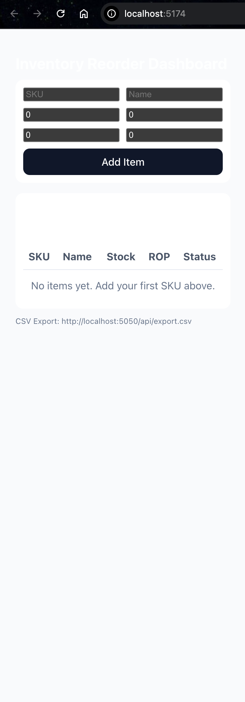
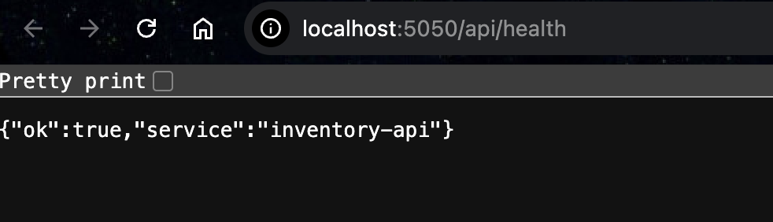

# Inventory Reorder Dashboard

A full-stack inventory management application that calculates **Reorder Point (ROP)** and inventory status based on demand and lead time.  
Built to demonstrate practical supply-chain logic implemented using modern web technologies.

---

## 📸 Screenshots

> Dashboard overview and item management




---

## 🚀 Features

- Add and manage inventory items
- Automatic **Reorder Point (ROP)** calculation
- Inventory status indicators (OK / Low / Reorder)
- REST API built with Node.js & Express
- SQLite database for persistent storage
- CSV export for reporting and analysis
- Clean React frontend using Vite

---

## 🧠 Business Logic

**Reorder Point (ROP)** is calculated using:


ROP = (Daily Demand × Lead Time) + Safety Stock


This helps determine **when inventory should be reordered** to avoid stock-outs.

---

## 🛠 Tech Stack

### Frontend
- React
- Vite
- JavaScript
- HTML / CSS

### Backend
- Node.js
- Express.js
- REST APIs

### Database
- SQLite

---

## ▶️ Run Locally

### 1️⃣ Backend
```bash
cd server
npm install
npm run dev


API runs at:

http://localhost:5050

2️⃣ Frontend
cd client
npm install
npm run dev


Frontend runs at:

http://localhost:5173

📁 CSV Export

Download inventory data as CSV:

http://localhost:5050/api/export.csv

📌 Use Case

This project demonstrates how supply chain and inventory concepts can be translated into a working software system, making it useful for:

Supply Chain Analytics

Operations Management

Inventory Planning

Full-Stack Development portfolios

👤 Author

Vraj Patel
GitHub: https://github.com/bl4ck0uc4st

📄 License

This project is for learning and portfolio purposes.
